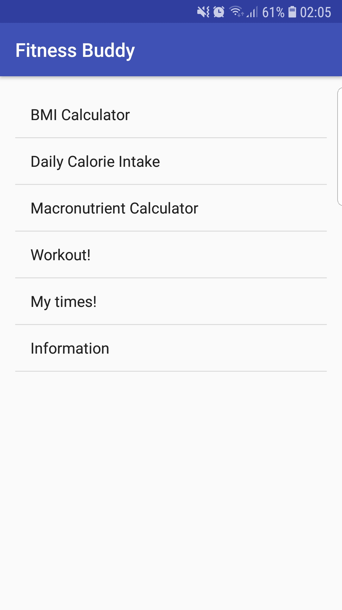
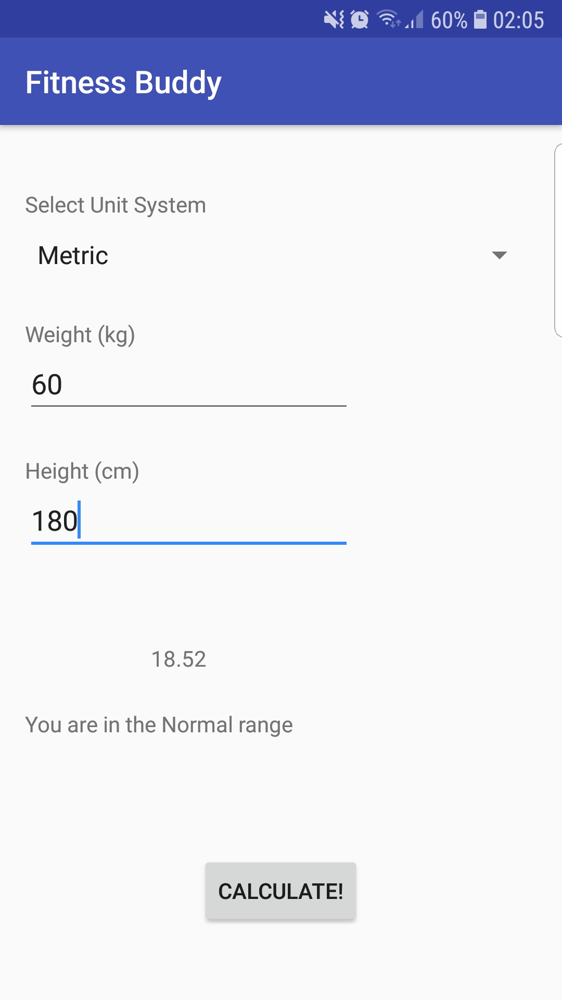
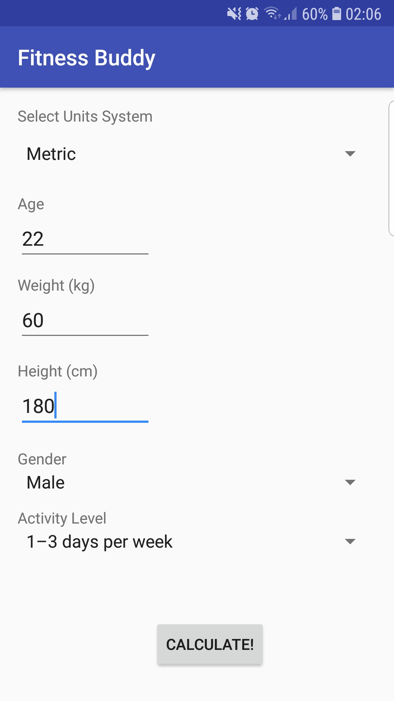
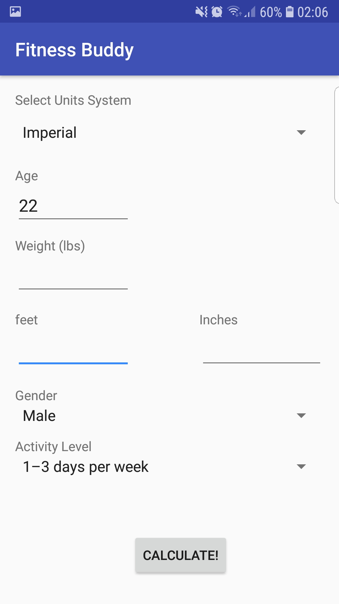
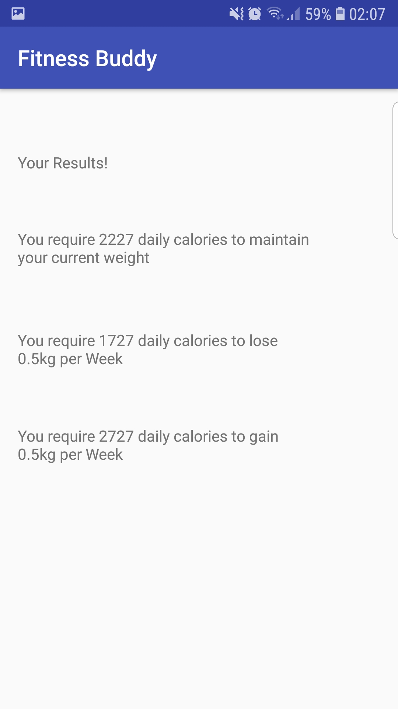
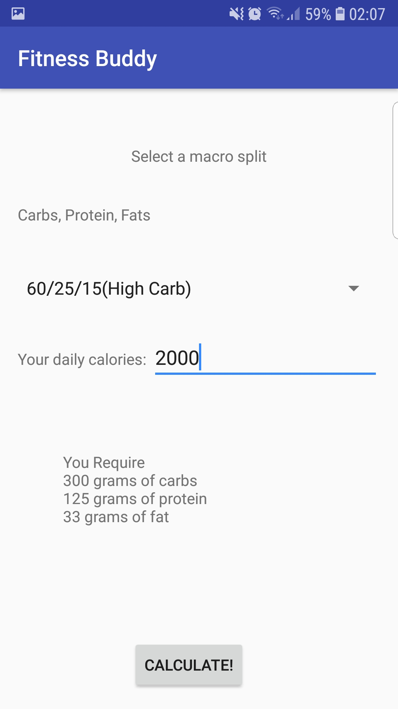
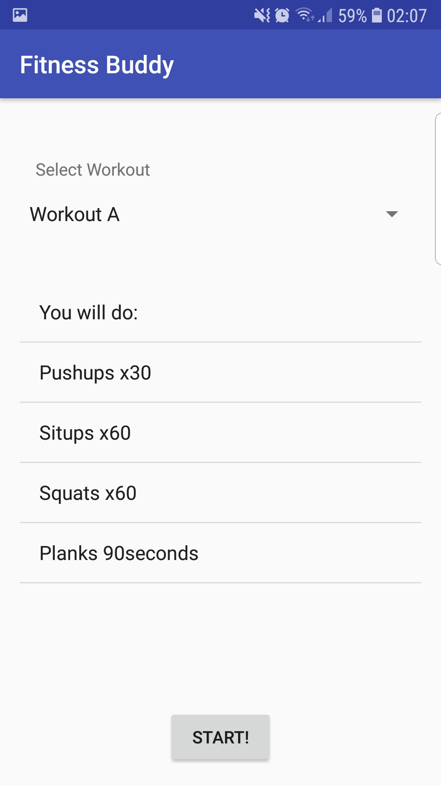
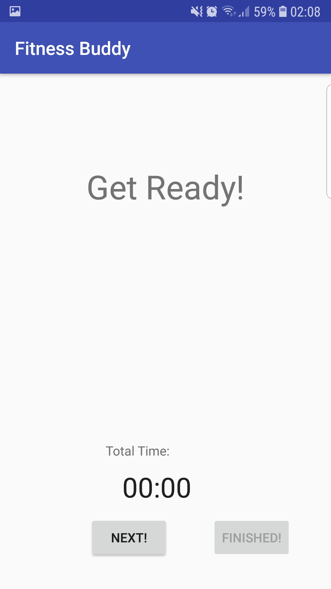
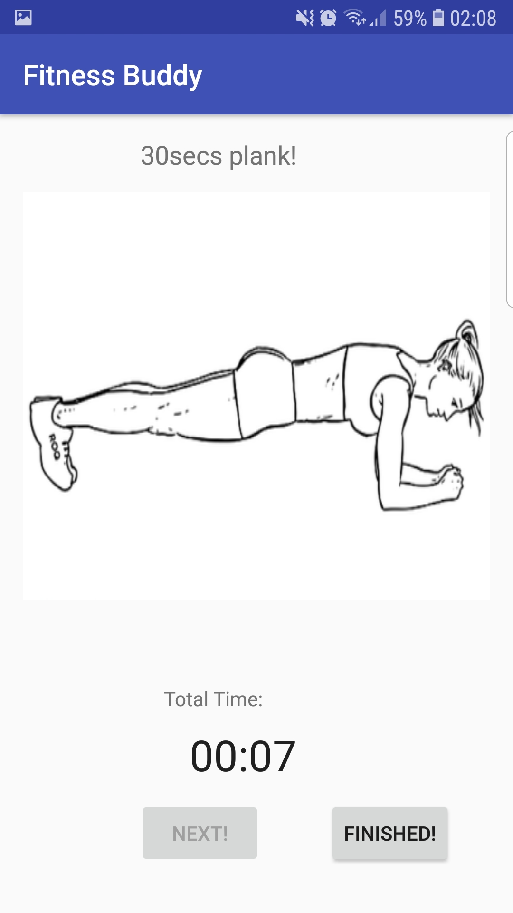
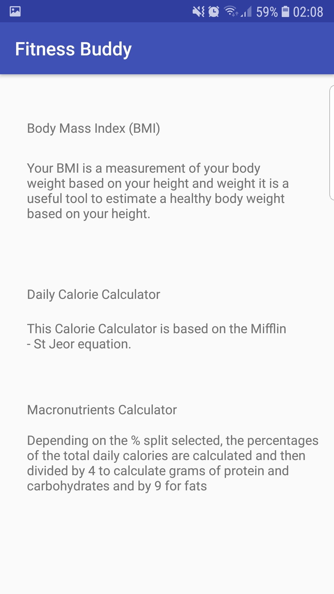

<h1>FitnessBuddy</h1>

FitnessBuddy Android application created using Android Studio.
This was the first smartphone application that I have ever created, and my first experience using Android Studio.

Documentation for the process of creating the application is provided in the "40214330 Report.pdf" file.

This application deals with many user input data. This means that all forms in the application must handle errors to only allow correct data. The application will alert if any user data input is incorrect by using a toast message.

The following are screenshots of the application running on my smartphone (Samsung S7 Edge). Source images can be found in the images folder (the text on the README images can be hard to read since they are resized).

<h2> The application </h2>

<h3>Main Menu</h3>

I aimed to make the app simple and easy to use. The main menu provides access to all the functionality of the application.

<h3>BMI Calculator</h3>

BMI Calculator allows users to calculate their body max index. 
Users can choose to use either metric or imperial unit system in order.
Once a user inputs appropriate data and the "CALCULATE!" button is pressed, his BMI will be displayed.

<h3>Daily Calorie Intake</h3>

Through using the app, users can also calculate calories required to meet their needs (gain, lose, or maintain weight).
As seen in the picture below, users can choose metric or imperial unit systems.

 

Results are displayed once the form is filled out with the correct information and 'CALCULATE!' button is pressed.

<h3>Macronutrient splits</h3>

App can calculate macronutrients depending on the choice of diet selected by the user for a specific number of calories. 

<h3>Workout Selector</h3>
Users can select different types of workouts. Selecting one will change the "You Will do:" section to the new list of exercises. 

<h3>Starting and finishing a workout</h3>

Once a user selects a work out and pressed 'START' BUTTON, the application will wait until they are ready. Upon pressing the 'NEXT' button, a timer will start, and the user is indicated what exercise they must do (using images) and the number of repetitions.
Once they finish the last exercise, they can press 'FINISHED' button to end the workout. The workout will be saved to the database with its name and time elapsed to complete it.

 

<h3>Workout times saved on Database</h3>

All the names of the completed workouts and their times for completion (saved on the database) can be displayed as shown:

<h3>Information Page</h3>

General information page provides some insight on BMI, daily calorie intakes, and macronutrient sections.

