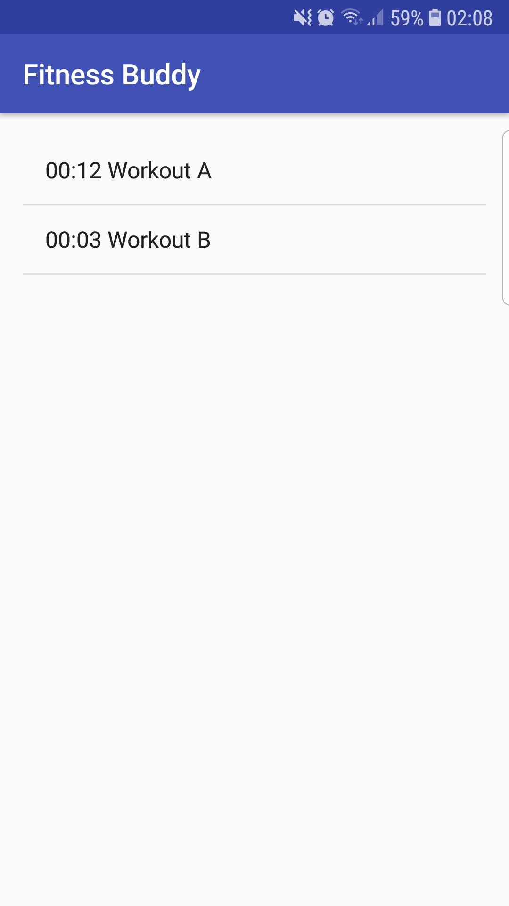

<h1>FitnessBuddy</h1>

Fitness Buddy Android Application created in Android Studio.
Documentation of the process of creating the application is also provided in the "40214330 Report.pdf" file.
The application deals with alot of user input data, meaning that all the forms require to have some type of error handling to only allow correct data. The application will alert the user if any data is incorrect by using a toast message.
The following are screenshots of the application running on my smartphone (Samsung S7 Edge), source images can be found in the images folder.

<h2> The application </h2>

<h3>Main Menu</h3>

The theme of the app was to remain simple and easy to use. The main menu provides access to all the functionality of the application. 

<h3>BMI Calculator</h3>

It allows the user to calculate their body mass index. The application always allows the user to use either the Metric or Imperial unit system in order to accomodate different types of users. Once the data is input and the button is pressed, the results are displayed.

<h3>Daily Calorie Intake</h3>

It allows the user to calculate the calories they require depending on their needs (gain,lose or maintain weight).
As seen bellow it also allows both imperial and metric unit systems.

 

These are the results displayed once the form is filled with the correct information and the button is pressed.

<h3>Macronutrient splits</h3>

Allows to calculate macronutrients depending on the choice of diet selected for a specific number of calories.

<h3>Workout Selector</h3>

There are different types of workouts that the user can select. Selecting one will change the "You Will do:" section to the new list of exercises. 

<h3>Starting and finishing a workout</h3>

Once the user has selected a workout and pressed start, The application will wait until they are ready. Upon pressing the next button, a timer will start. The user is indicated what exercise they must do (using images) and the number of repetitions. Once they reach the last exercise, the finished button will be available and it will end the workout saving the name of workout and time elapsed to the database.

 

<h3>Workout times saved on Database</h3>

Here is where all the names of the workouts and their times for completition are displayed (the ones that were saved previously in the database).

<h3>Information Page</h3>

This last page is a general information page which provides some insight on the BMI, daily calories and macronutrient sections.

